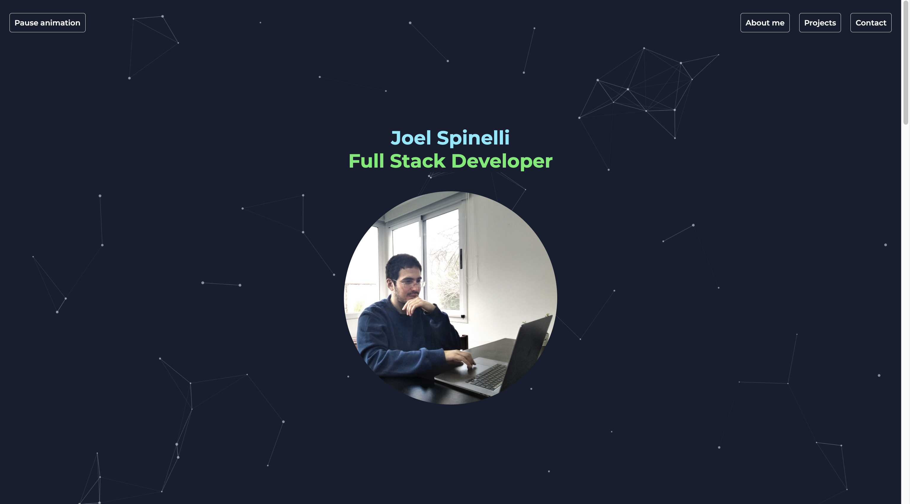
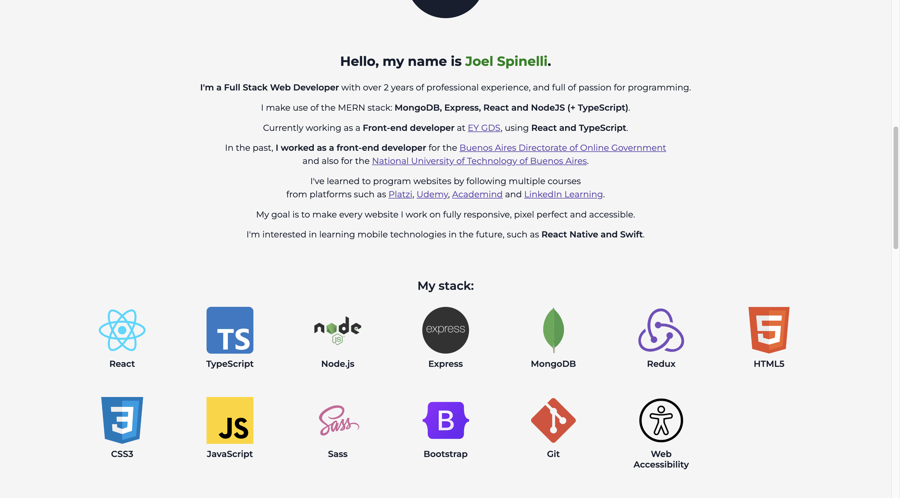
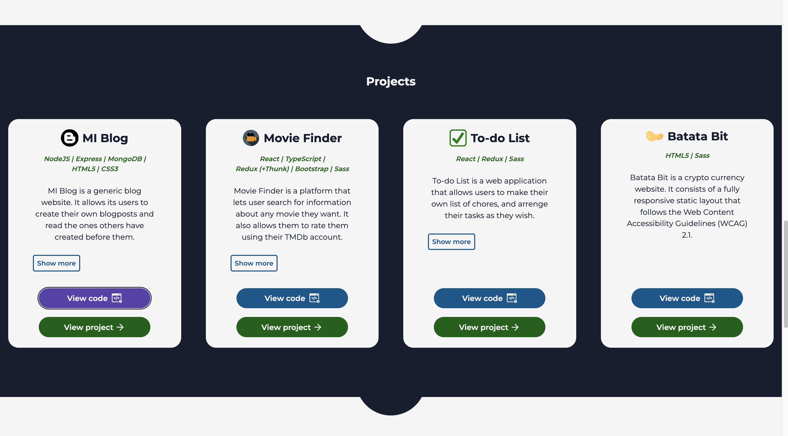
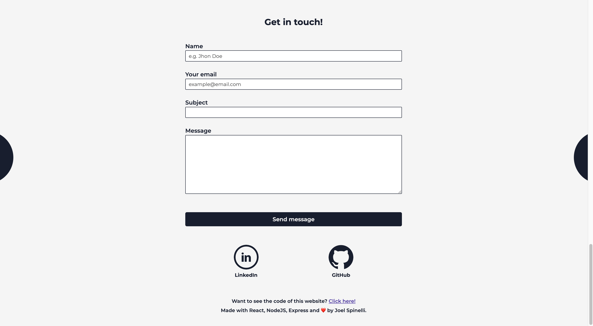

# Joel Spinelli's Personal Portfolio

Webpage made with React to display some basic information about myself and show some projects I made.

It features:
* A projects section in which other works made by me can be seen.
* A fully functional contact form that allows the user to directly send me an email without leaving the website. 
* An accessible and fully responsive UI that follows the Web Content Accessibility Guidelines (WCAG) 2.1 (AAA).

To build it I used the following: 
* React 
* NodeJS 
* Express 
* Sass

## In case you want to run this project in your local environment: 
You need to have both node and npm installed on your computer. I recommend installing them by using the [Node Version Manager](https://github.com/nvm-sh/nvm) (nvm), otherwise you can download them from [here](https://nodejs.org/en). 

To build this project I used Node v16.15.1 and npm v8.11.0, so it's also advisable that you use the same versions. 

Follow these steps: 
1. Open the project on your preferred code editor. 
1. Open a terminal and go inside the frontend directory: **cd frontend**
1. Run the following command: **npm install**
1. Run the following command: **npm start**

__Optional__: You could also make the contact form functional, but that will require extra, more complex steps: 
1. Open a new terminal and go inside the backend directory: **cd backend** 
1. Run the following command: **npm install**
1. Create a file called **.env** and inside of it declare the following environment variables: 
    1. **EMAIL**=insert_here_your_email (use a gmail account)
    1. **PASS**=insert_here_your_application_password (if you want to be able to use the contact form, you'll need to create an application password for your gmail account and authorize it)
    1. **PORT**=insert_here_the_port_number_in_which_you_want_to_run_the_project's_backend_server 
1. Make sure that the proxy address (declared inside of frontend's package.json) matches with the port in which you are running your back end server. 
1. Run the following command: **npm run devStart**

## Screenshots

_I don't claim ownership for any of the images used on it (beside the ones that include myself in them)._
